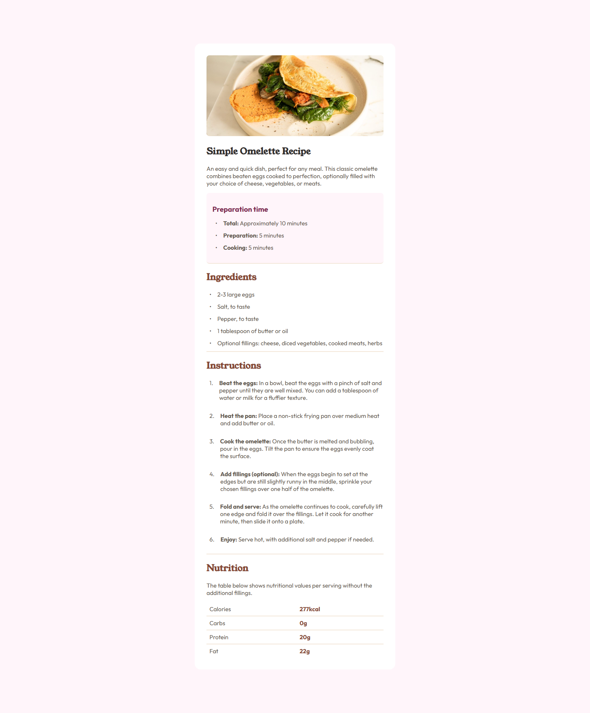

# Frontend Mentor - Recipe Page Solution

This is a solution to the Recipe Page challenge on Frontend Mentor.

### Screenshot

### Links

- [Challenge URL:](http://frontendmentor.io/challenges/recipe-page-KiTsR8QQKm)  
- [Live Site URL:](https://friedmantech.github.io/recipe-page/)

### Built with

- Semantic HTML5 markup
- CSS Custom Variables
- CSS Flexbox
- Responsive Design
